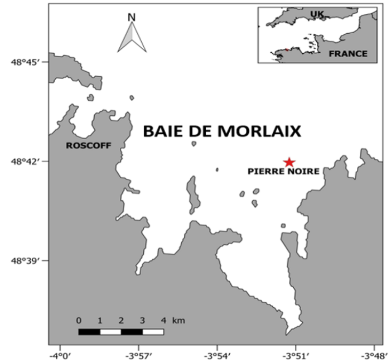

**/!\ NE PAS FAIRE "VISUAL" car change la structure**
# Rendre FAIR certains points de l'étude "Evolution de la production secondaire d'une communauté macrobenthique de sable fin en baie de Morlaix"_
## I- Introduction 
### 1.1) Résumé du projet et contexte

_Carte montrant l'emplacement du site d'étude : Pierre Noire_

Les pressions anthropiques croissantes perturbent la structure et le fonctionnement des écosystèmes côtiers.Ces problématiques ammènent les scientifiques à mettre en place des suivis des communautés marine pour caractériser leur état de santé. A titre d'exemple, suite à la marée noire de l’Amoco Cadiz en 1978, la station Pierre Noire (baie de Morlaix) fait l'object d'un suivi à long terme de sa communauté macrobenthique.La production secondair est un bon indicateur de l’état écologique d’une communauté. Elle peut se faire à l'échelle des populations, à partir de l'analyse de la croissance et de la mortalité, ou bien à l'échelle des communautés via des modèles empiriques. Un des modèles les plus utulisé est celui de Brey (2012), qui n'avait jusque là jamais été utilisé pour Pierre Noire.Ce modèle, basé sur un calcul par un réseau de neurones, permet d’estimer la production secondaire à partir de diverses variables écologiques et environnementales.

### 1.2) Objectifs du stage
Les différents objectifs de ce stage étaient de : 
- 1 : Compléter les suivis et analyses sur la structure + le fonctionnement de la communauté macrobenthique de Pierre Noire, via l'estimation de la production secondaire
- 2 : Relier les variations interannuelles de la production secondaire à celles de la structure de la communauté 
- 3 : Estimer la contribution des groupes taxonomiques et guildes trophiques à la production secondaire
- 4 : Objectif additionnel -->  Comparer les ratios P/B (productivité) calculés par différents modèles empiriques à des valeurs in situ, considérées comme mesures de référence

Problématique globale de l'étude : quelle est la relation entre l’évolution de la production secondaire et
les changements de structure de la communauté de Pierre Noire ?

### 1.3) Données de départ (non FAIRisées)
Pour répondre aux objectifs, les fichiers fournis initialement étaient les suivants, sous format Excel (.xls) : 
- "pn-2010-2022_compil-abundance_biomasses_harm_iso.xls" : Abondances et biomasses (mars et octobre, de 2010 à 2022)
- "FC-PN-77-07_AD.xls" : Matrice de traits fonctionnels + son codage en métadonnées (préciser codage des traits + tableau taxonomie ?)
- "ProductivityANN01.xls" : Macro Excel développée par Brey pour le calcul de la productivité

Au cours du stage, plusieurs tableaux dits "intermédiaires" ont également été produits. Ils ont servi directement aux analyses réalisées sous R et ne présentent donc aucune description ou métadonnées.  

+ mettre image d'un tableau de donnée initial
Voici à titre d'exemple la structure initiale du fichier "pn-2010-2022_compil-abundance_biomasses_harm_iso".

### 1.4) Organisation initiale de l'espace de travail
``` 
├── M1 Sciences de la Mer 
│ └── Stage Roscoff 
│     └── Articles stage 
│          └── Articles fournis
│          └── Différentes versions du rapport de stage et des présentations
│     └── Data stage
│          └── Résultats et graphique 
│                   └── Fichiers pdf des résultats
│                   └── Images des graphiques
│          └── Tableaux Brey (Taxo + abiotique)
│                   └── “FC-PN-77-07-AD.xls"
│                   └── “Tableau data input Brey(ANN).xls”
│                   └── “taxonomy-PN-77-07.xls”
│                   └── “Coding.xls"
│          └── Fichiers et scripts PCoA ACP R
│                   └── "PCoA_Bio_wthrare.xls"
│                   └── "Cor_TProd.xls"
│                   └── "Cor_BioProdg_Somme.xls"
│                   └── Scripts tests
│          └── Comparaison modèles empiriques
│                   └── Images de formules issues des articles
│                   └── Tableaux de comparaison
```
Bien qu'on observe une première logique d'organisation, la structure reste complexe et difficile à appréhender. 


### Scripts R initiaux
Les scripts R initiaux présentent plusieurs points qui ne respectent pas le processus FAIR : noms des fichiers peu explicites, manque de commentaires pertinents, absence d'une structure.
Voici un exemple d'un script (["PCoA Bio withoutrare.R"](./Scripts/Scripts_initiaux/PCoA Bio withoutrare.R)) non FAIRisé, représentatif de l'ensemble des scripts initiaux : 

```
library(vegan)
... 
library("writexl")

# j'officialise la colonne année dans pas PCoA
head(PCoA_Bio_wthrare)
rownames(PCoA_Bio_wthrare)
...
# je tente un truc pour les espèces qui contribuent le +
...
```
Des commentaires sont présents mais souvent personnalisés, et les explorations / tests effectués n'ont pas été retirés, ce qui réduit la compréhension.Il manque également la première description : le but du script, la personne l'ayant écrit à quelle date et avec quelles versions. Le chargement des données intermédiaires est absent (qui était fait manuellement à chaque fois).

## 2) FAIRisations d'une partie des données

Cette deuxième partie vise à décrire les améliorations mises en place pour rendre une partie des données et analyses plus "FAIR". Etant donné du temps limité, cette FAIRisation reste partielle. Cependant, les différentes approches présentées peuvent être étendues au reste des données. Le dernier objectif du stage (comparer litterature et modèles empiriques) nous a paru difficile à fairiser.

### 2.1) Nouvelle organisation de l'espace de travail
Suite à nos modifications, nous proposons une nouvelle organisation de l'espace de travail. Une arborescence plus claire est définie : 
```
├── Projet Macrobenthos
│ └── Inputs
│     └── Données initales
│     └── Metadonnées
│          └── MetadataTaxonomy-PierreNoire-2010-2022
│          └── MetadataSampling-PierreNoire-2010-2022
│ └── Scripts
│      └── PCoa_BiomassWithoutRareSpecies.R
│      └── Correlation_TemperatureProduction.R
│      └── KruskalWallis_Boxplot_Productivity.R
│ └── Output  
      └──
│      └── Données intermédiaires 
│      └── Résultats statistiques
│            └── 
```    
```
├── Projet macrobenthos
│ └── Inputs
│     └── Données initales
│         └── A COMPLETER avec meilleurs noms
│     └── Metadonnées
│         └── MetadataTaxonomy-PierreNoire-2010-2022
│         └── MetadataSampling-PierreNoire-2010-2022
│ └── Scripts
│     └── PCoa_BiomassWithoutRareSpecies.R
│     └── Correlation_TemperatureProduction.R
│     └── KruskalWallis_Boxplot_Productivity.R
│ └── Output  
│     └── Données intermédiaires 
│         └── CorrelationData_TProd.csv
│         └── PBDataFor_KruskallWallis_BoxPlot.csv
│         └── PCoA_Bio_WithoutRareSpecies.csv
│     └── Résultats statistiques
│         └── COMPLETER GRAPHES PCA
```    
/!\ données intermédiaires obtenues manuellement mais pour une vraie fairisation aurait dûes être obtenues via R
/!\ Sur github scripts initiaux VS finaux car problème avec un des script et à dû effacer 

### 2.2) Description des analyses

## Calcul de la biomasse
D'après le fichier initial, les biomasses saisonnières moyennes pour chaque espèce ont été ajoutées à partir d'un fichier annexe "PN_biomasses-moy_mars-oct-ajusté_isotopes".

Les biomasses moyennes annuelles pour chaque espèce ont été calculées en faisant la moyenne des biomasses en octobre et mars, à partir du fichier PN-....." (remplacer par le nouveau nom ?)

### Calcul de la productivité

La productivité de chaque espèce (ratio P/B), pour l'ensemble de la période étudiée, a été calculée à l'aide de la Macro Excel de Brey (2012). Cette macro nécessite le remplissage d'un ensemble de variables environnementales et biotiques pour obtenir une estimation de la productivité, et ce pour chaque année. Parmi ces variabkes, les données de température issues de SOMLIT sont indispensables. + ajouter que j'ai moi même fait la moyenne piur ces données de T° ? 

## Calcul de la production
Le calcul de la production, pour chaque espèce, correspond à Productivité*Biomasse moyenne de l'espèce et ce sur l'ensemble de la période étudiée. 

## Scripts : Analyses statistiques et multivariées (à modifier)

Fournir nouvelle image de uscript post transformation 

Au cours du stage, plusieurs analyses ont été réalisées. Trois analyses principales ont été retenues dans le rapport final.

# Régression linéaire entre Témpérature et Production secondaire

Cette analyse vise à tester l'existence d'une relation entre la température moyenne annuelle (calculée à partir des données SOMLIT) et la production secondaire annuelle. 

# Comparaison des productivités entre groupes trophiques 
L'objectif était d'examiner comment les valeurs de productivités (ratios P/B) variaent en fonction des grands groupes taxonomiques définis (prédateurs, suspensivores, déposivores de surface ou subsurface). 

# Analyses statistiques et multivariées (modifier)
Une Analyse en Coordonnées Principales (PCoA) a été réalisée à partir des données de biomasse moyennes annuelles, afin d'explorer les changements de structure de la communauté au fil du temps. Ces résultats ont ensuite été compaés aux variations internannuelles de production secondaire afin d'identifier un éventuel lien entre les variations de structure de la communauté et les variations de production.


### 2.3) Données intermédiaires

Calculs productions au seind es excel mais aurait du etre fait sur R, donc ne seront pas traités 
Pour réaliser les statistiques, des fichiers excel intermédiaires ont été faits mais ne sont pas fairisable (devrait faire scripts mais manque de temps) mais on s'est servi de fichiers excel, cela peut constituer un biais.

### 2.4) Traçage des données initiales 


## a) Traçage des données initiales - Tableau des abondances et biomasses 
- PID de la zone
- PID de la station PN 
- PID SOMLIT - PID des auteurs (Sarah
Bureau) 
- PAS FAIRISABLE : Il manque les sources de la matrice de traits
fonctionnels, a été transmise telle quelle, a été complétée sans non plus
ajouter les sources au fur et à mesure, n'a pas indiqué les endroits qui
ont été estimés si rien n'a été trouvé dans le bibliographie

## b) Ajout de métadonnées
Deux fichiers csv ont été crée afin de faciliter la lecture du tableau principal ("ComptageBiomasseFaune-PierreNoire-2010-2022"), leur noms indiquant explicitement le contenu :
- ["MetadataTaxonomy-PierreNoire-2010-2022.csv"](./Metadonnées/MetadataTaxonomy-PierreNoire-2010-2022.csv) : Nom dans le tableau donné pour le stage M1, AlphaID et nom
    accepté (au 2 Décembre 2025) en important les noms scientifiques
    (Genre espèce ou genre sans sp. ou spp. derrière si l'espèce n'était pas spécifiée) sur WoRMS
Ajouter exemple métadata ou pas vu qu'on met le lien ?
- ["MetadataSampling-PierreNoire-2010-2022.csv"](./Metadonnées/MetadataSampling-PierreNoire-2010-2022.csv) : fichier contenant la méthode d'échantillonage, la latitude, 
   la longitude, le PID associé, la profondeur, la date d'échantillonage, la surface échantilloné, l'unité 
   et enfin l'opérateur (non renseignée ici car infirmation indisponible)
   
### c) Améliorations des scripts sur R

Pas d'ordre spécifique nécessare aux scripts car chacun correspond à une analyse différente
Le script initial ["PCoA Bio withoutrare.R"](./Scripts/Scripts_initiaux/PCoA Bio withoutrare.R) à été amélioré en ["PCoA_BiomassWithoutRareSpecies.R"](./Scripts/Scripts_finaux/PCoA_BiomassWithoutRareSpecies.R) comme suis : 
```
########################################################
# Description : Analyse PCOA - Données annuelles de biomasse (sans espèces rares)
# Nom : PCoA_BiomassWithoutRareSpecies.R
# Auteur : Clothilde GUERIN (PID = ...)
# Date : 3 Décembre 2025
########################################################

##### Chargement des données ####
PCoA_Bio_WithoutRareSpecies <- read.csv("data/PCoA_Bio_WithoutRareSpecies.csv")

##### Chargement de la librairie ####
library(vegan) #PCoA et distance de Bray-Curtis
...
library(ggrepel) #empêche les étiquettes de se chevaucher

#### Mise en forme du jeu de donnée ####

# La colonne "année" doit être officialisée car elle n'est pas correctement définie dans le dataset d'origine
head(PCoA_Bio_WithoutRareSpecies)
rownames(PCoA_Bio_WithoutRareSpecies)
...
```
Ainsi, ont été ajoutés : la bannière (auteur, date version, description), titres et commentaires plus clairs/ détaillés (notemment des packages mais devraient eux aussi avoir leur version - manque de temps), et le chargement des données.
Mais manque le fait que tout doit être écrit en anglais

## IV- Conclusion
### **à retirer ?** Axes d'améliorations qui n'ont pas pu être mis en place (à intégrer direct au fil du readme)
Certains formatages et calculs comme ceux de la production, la productivité, etc. ont été effectués manuellement sur Excel lors du stage, 
qui auraient mérités d'être réalisés avec R pour augmenter la reproductibilité, 
cependant nous n'avons pas pu les modifier dans le temps imparti.

-   Montrer les premières lignes des scripts améliorés avec leurs noms
    en haut comme ex du diapo
Au final, 
